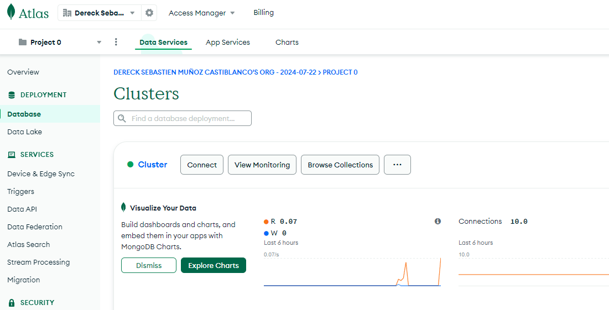

# tecnofactory-marvel-app-frontend

Este proyecto es una aplicación frontend para gestionar usuarios y cómics de Marvel. La aplicación está construida utilizando Angular y sigue las mejores prácticas de desarrollo.

## Características

- Registro de usuarios
- Autenticación de usuarios
- Listado de cómics de Marvel
- Visualización de detalles de cómics
- Gestión de cómics favoritos de los usuarios

## Requisitos

- Node.js
- npm (Node Package Manager)
- Angular CLI

## Uso

Para abrir la página utilizar este link: https://dereck797.github.io/tecnofactory-marvel-app-frontend/login.

## Base de Datos

Para visualizar la bd, ingresar a https://account.mongodb.com/account/login con las siguientes 

**credenciales: emailAddress: munozderecksebastian@gmail.com, Password: tecnofactory-marvel**

Dar click en Browse Collections:



## Instalación (Solo necesario en caso de agregar nuevas funcionalidades)

1. Clona el repositorio:
   ```bash
   git clone <URL_DEL_REPOSITORIO>
   cd tecnofactory-marvel-app-frontend
   ```

2. Instala las dependencias:
   ```bash
   npm install
   ```
   ```

3. Inicia la aplicación:
   ```bash
   npm start
   ```


